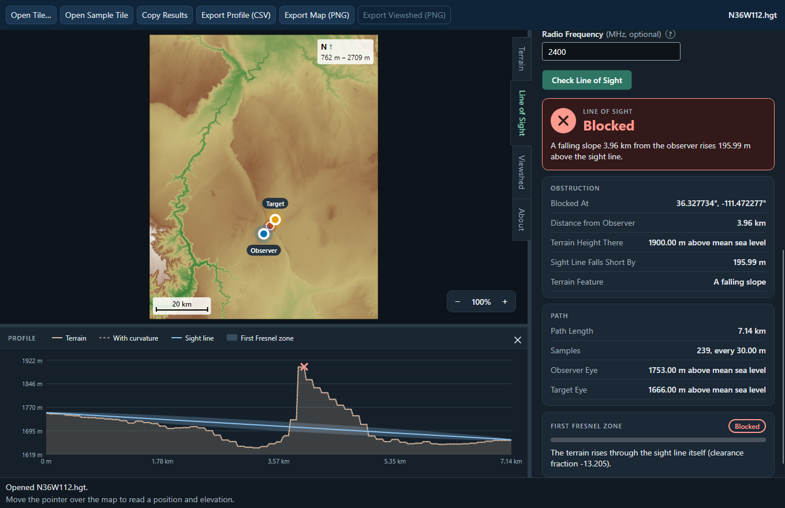

# Terrain Line-of-Sight and Viewshed Engine

"Can point A see point B, given the terrain in between?" comes up in a lot of
practical contexts: planning where a radio or telecom tower needs line of sight to
another tower, choosing an observation/camera position that covers the most ground,
or checking whether a ridge blocks a sightline before you hike somewhere to find out.
This library answers that question against real elevation data, accounting for how
far the ground actually drops away due to Earth's curvature — a flat map alone gets
this wrong past a few kilometres.

A C++17 library, command-line tool and Windows DLL that answer four questions about
the ground between points:

1. **Terrain profile** — ground elevation along a path between two geodetic points,
   sampled at a stated spacing.
2. **Line of sight** — can an observer at point A see a target at point B, each at a
   stated height? If blocked, the position, elevation, and clearance deficit of the
   blocking point, and what kind of terrain it is. The library takes each height above
   the ground, above mean sea level, or above the ellipsoid with its geoid undulation;
   the DLL, the command line and TerrainBench take heights above the ground for now.
3. **Viewshed** — from one observer, which cells within a radius are visible, as a
   raster mask, for the ground itself or for a target of a given height.
4. **Minimum visible height** — from one observer, for every cell within a radius, how
   high above the ground a target there must stand to be seen: 0 where the ground itself
   is. Asked for any one height, it gives exactly that height's viewshed.



## Try it

**TerrainBench** is a desktop app on top of the engine: open a tile, put two points on
the map, and read the answer and the reason for it. Download it from this repository's
**Releases** page:

- **`TerrainBench-<version>-win-x64.msi`** — an installer for the current user, with no
  administrator rights needed; or
- **`TerrainBench-<version>-win-x64-portable.zip`** — unzip anywhere and run
  `TerrainBench.exe`.

Windows 10 or 11, x64; nothing else needs installing. The build isn't code signed, so
SmartScreen may say "Windows protected your PC": choose **More info**, then **Run
anyway**. On first start, a short tour has you open the bundled Grand Canyon
sample tile and try each tool on it. What the app does, and how it is built and
tested: [docs/TERRAINBENCH.md](docs/TERRAINBENCH.md).

## At a glance

- **Real data.** SRTM `.hgt` tiles at 3 arcseconds (~90 m) and 1 arcsecond (~30 m); a
  3-arcsecond tile of the Grand Canyon is included in `DATA/`.
- **Honest answers.** Missing data is never read as sea level: a path that crosses a
  void is reported as "no confident answer", not as visible. An input the library
  can't answer — a spacing of zero, a coordinate or height that isn't a number, a grid
  at a pole — is refused with the reason, by the library itself.
- **Fast, and measured against exact.** A 50 km profile takes under half a millisecond;
  a 30 km-radius viewshed (2000 × 2000 cells) under two seconds — some 180 times
  faster than checking every cell on its own. Over the cells either one finds visible,
  the two differ on at most 26% at three test observers, almost all of it the boundary
  of the visible region drawn one cell off; under 2% is off that boundary.
- **Many targets from one place.** Prepared once per observer (1.7 s, 67 MB for 50 km),
  it answers about six million targets a second on one core -- anywhere within 50 km, on the
  ground or up to 15 km in the air -- against some 5,000 a second by line of sight. At worst
  the two differ on 2.6% of the targets either sees, nearly all on the edge of what can be
  seen, and a query allocates nothing.
- **Every core, the same answer.** Many observers against many targets, and the exact
  viewsheds, run on every core -- about eleven times as fast on 8 cores and 16 threads --
  with the same answer, to the bit, as on one.
- **Tested.** 75 engine tests and 141 app tests, all run by `build.ps1` and by CI on
  every push. Each fix was also checked the other way: the defect put back, and a test
  going red.

## What's in the repository

| Target             | Type            | Depends on                          |
|--------------------|-----------------|--------------------------------------|
| `TerrainCore`      | Static library  | **C++17 and the standard library only** — the algorithms and the sampler interface |
| `TerrainReader`    | Static library  | `TerrainCore` + the standard library — the `.hgt` tile reader |
| `TerrainEngine`    | Console exe/CLI | `TerrainCore`, `TerrainReader`, plus Windows-only `<windows.h>`/`<psapi.h>` for peak-memory reporting |
| `TerrainEngineApi` | Windows x64 DLL | `TerrainCore`, `TerrainReader`, `<windows.h>`; the C runtime linked in statically (`/MT`), so it needs nothing installed |
| `app/`             | .NET 10 app     | TerrainBench, reaching the engine only through `TerrainEngineApi.dll` |

The core has no include path to the reader, so it can't depend on a file format.
`TerrainEngineApi/TerrainEngineApi.h` exposes the engine to C or .NET (P/Invoke) through a
plain C header: numeric tile handles, result codes with a plain-English message,
DLL-allocated arrays released with `te_free`, and no C++ type or exception crossing the
boundary. The header documents every function's ownership rules, Big-O and
thread-safety, and its answers are bit-identical to the CLI's.

## Build from source

Needs Visual Studio 2022 with the **Desktop development with C++** workload (or its
Build Tools); the app also needs the .NET 10 SDK.

- **Engine only.** Open `TerrainEngine.sln`, build `x64` (`Release` for real use), and
  run `TerrainEngine.exe` with no arguments: it runs the test suite and a small demo on
  the included tile, writing `profile_output.pgm` / `viewshed_output.pgm`. If the
  1-arcsecond tile for the same square degree is at `DATA/SRTM1/N36W112.hgt` (NASA
  SRTMGL1 v003, `N36W112.SRTMGL1.hgt.zip`, unzipped), the tests and benchmark run
  against it too; without it, those parts skip.
- **Everything.** From the repository root:

  ```
  .\build.ps1                   # engine, CLI, DLL and app: build and run every test
  .\build.ps1 -Zip -Installer   # the same, then the portable zip and the MSI in artifacts/
  ```

## Command line

```
TerrainEngine.exe # run the 75-case test suite + demo
TerrainEngine.exe benchmark <profile|viewshed|minheight|observer|pairs> <hgtFile> <swLat> <swLon>
TerrainEngine.exe profile <hgtFile> <swLat> <swLon> <aLat> <aLon> <bLat> <bLon> <spacing> [nearest|bilinear]
TerrainEngine.exe los <hgtFile> <swLat> <swLon> <aLat> <aLon> <bLat> <bLon> <spacing> <hA> <hB> [k] [nearest|bilinear]
TerrainEngine.exe viewshed <hgtFile> <swLat> <swLon> <obsLat> <obsLon> <gridSize> <spacing> <height> [k] [nearest|bilinear] [targetHeight]
TerrainEngine.exe fresnel <hgtFile> <swLat> <swLon> <aLat> <aLon> <bLat> <bLon> <spacing> <hA> <hB> <frequencyMHz> [k]
TerrainEngine.exe batch <hgtFile> <swLat> <swLon> <queriesFile> [k]
```

For example, standing 2 m above the ground at (36.3, -111.5), can you see a point 2 m
above the ground at (36.35, -111.45)?

```
TerrainEngine.exe los DATA/N36W112.hgt 36.0 -112.0 36.3 -111.5 36.35 -111.45 0.0002697964817756191 2.0 2.0
```

The answer, and if blocked, exactly where and by how much. The spacing is in degrees:
0.0002697964817756191° is exactly the 30 m TerrainBench samples at, so the app and the
CLI answer this query identically. Every numeric argument is checked before anything
runs: text that isn't a whole, finite number, or a spacing, `k`, frequency or grid size
that isn't greater than zero, is reported by the argument's name with exit code 1, and
so is a path or grid the library itself refuses -- a latitude past a pole, a spacing too
fine to count -- with the library's reason. A `batch` queries file is a positive spacing followed by six numbers per query
(`aLat aLon bLat bLon hA hB`); a word where a number belongs, or a query cut short at
the end of the file, is reported the same way rather than silently skipped.

## Documentation

- [docs/ENGINE.md](docs/ENGINE.md) — the geometric model and its assumptions, the
  validity envelope, determinism, performance, fast vs. naive viewshed accuracy, the
  minimum visible height and its derivation, voids,
  the API contract, the rendered output, and Fresnel clearance, batch queries, tile
  boundaries and the "why" answer.
- [docs/TESTS.md](docs/TESTS.md) — the engine's test suite, case by case.
- [docs/INTEGRATION.md](docs/INTEGRATION.md) — adapting the library for a real-time host:
  vertical datums, raster blocks, allocation-free queries, threading.
- [docs/TERRAINBENCH.md](docs/TERRAINBENCH.md) — the desktop app: features, reference
  queries, tests, building and releasing.
- [NOTES.md](NOTES.md) — design notes: where the interface fought the algorithm, and
  what changed since.
