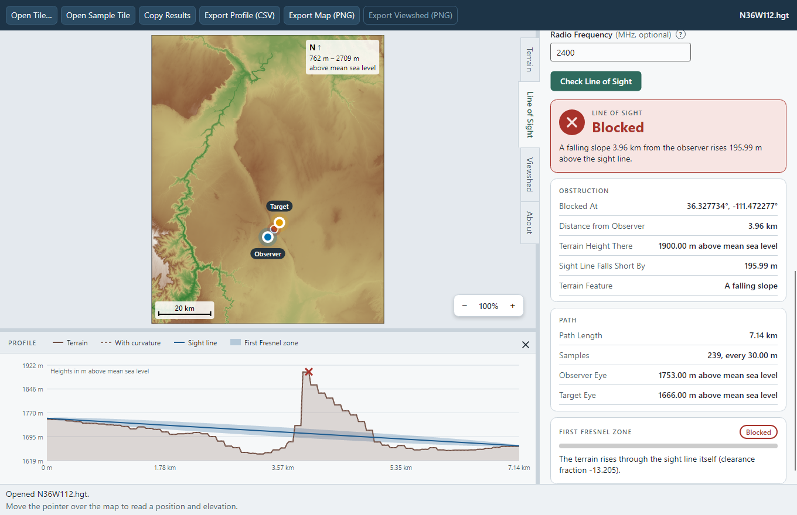
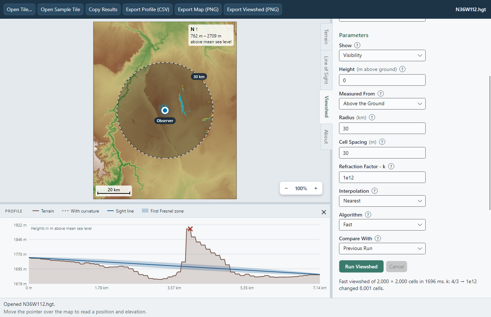
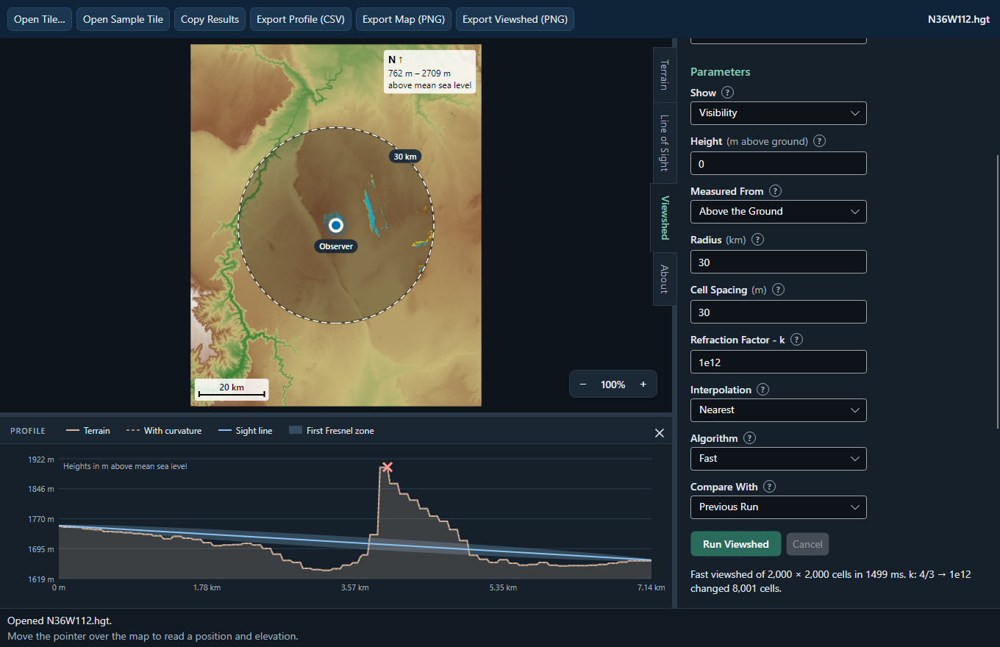
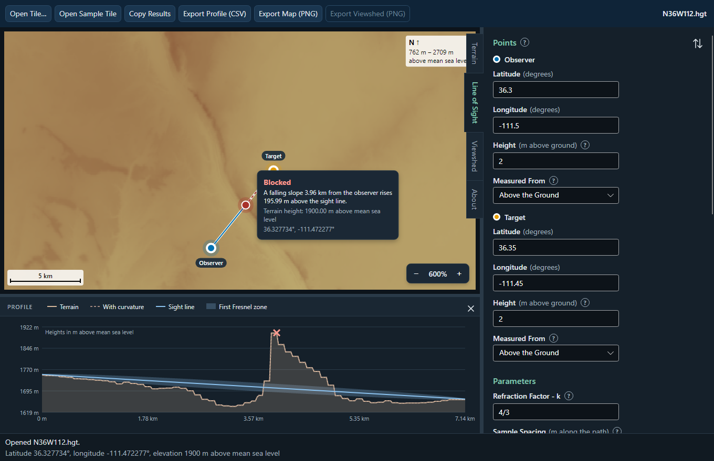
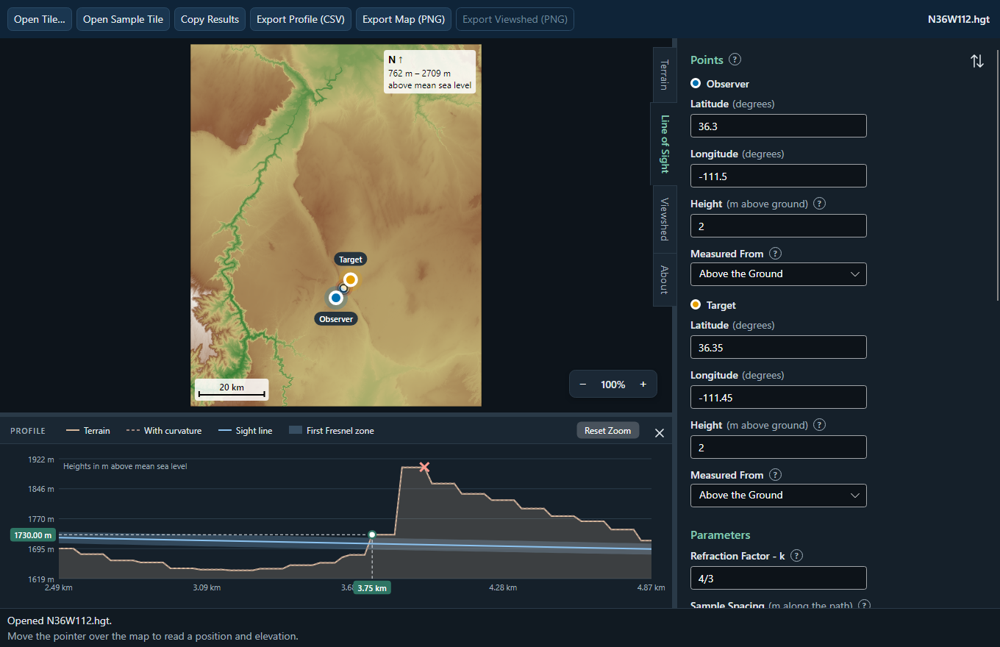
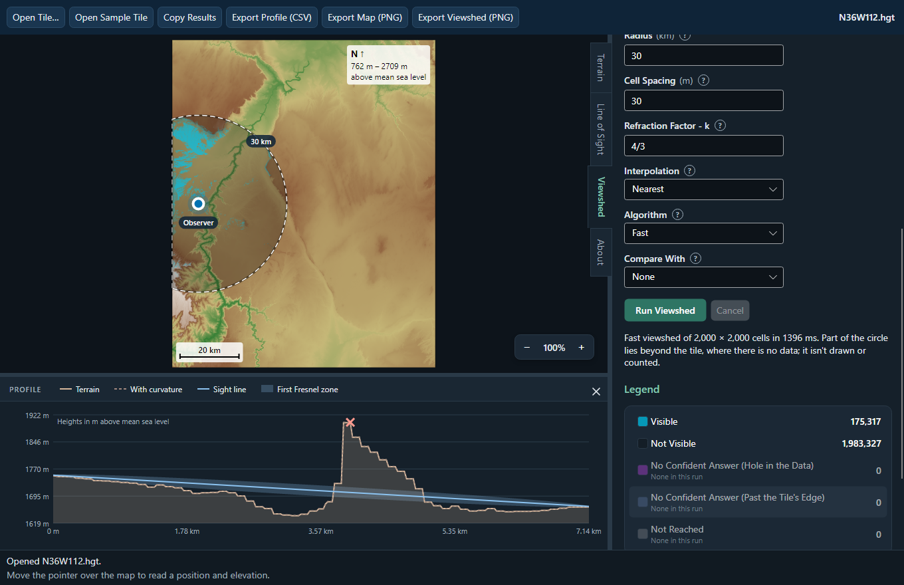
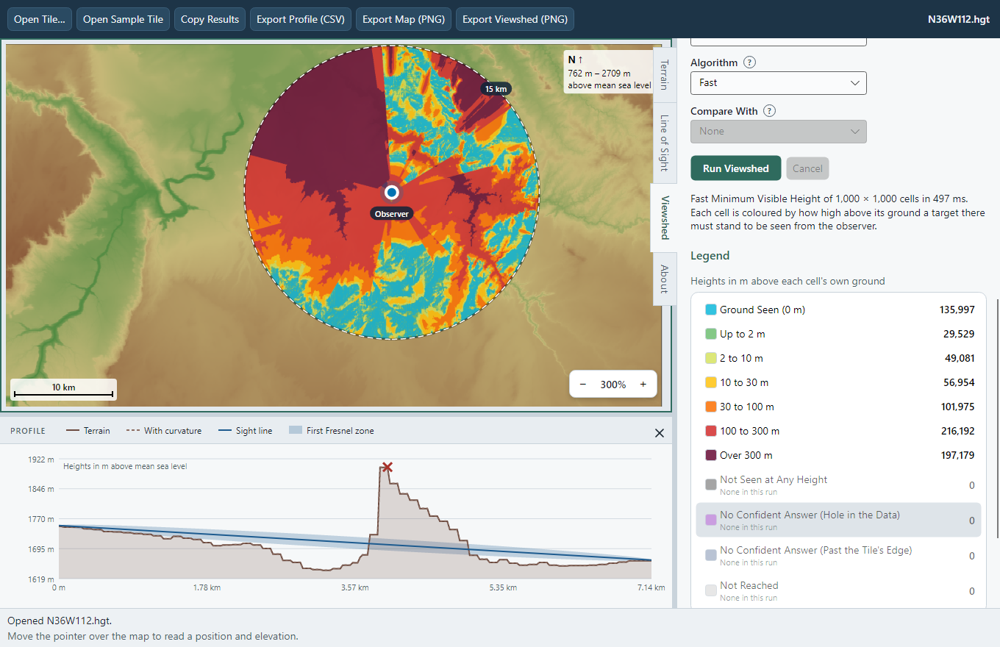
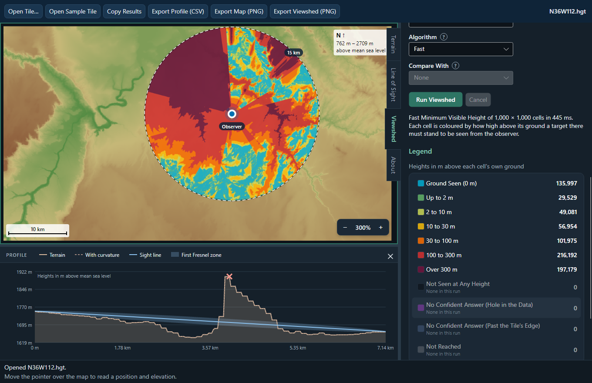
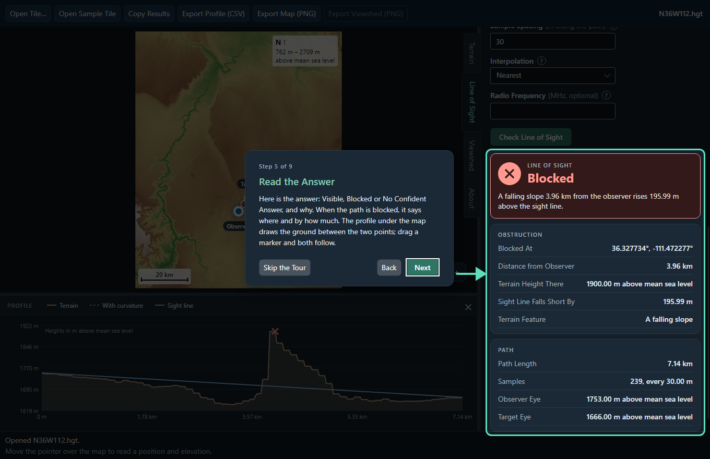

# TerrainBench: the desktop test bench

TerrainBench is for testing the engine without a compiler and without reading the code:
open a tile, put two points on it, and read the answer and the reason for it. It is a
.NET 10 / Avalonia 12 app in `app/`, and it reaches the engine only through
`TerrainEngineApi.dll`. Every elevation, distance, visibility and clearance on screen comes
from the DLL; the app lays results out and colours them.












## Download and run a release

Each release on this repository's **Releases** page has two downloads holding the same files.
Both need Windows 10 or 11, x64, and nothing else installed: the .NET runtime and the
engine's C runtime are inside.

- **The installer**, `TerrainBench-<version>-win-x64.msi`. It installs for the current user
  only, under `%LOCALAPPDATA%\Programs\TerrainBench`, asks for no administrator rights and adds
  TerrainBench to the Start menu, and to the desktop if its Options page's box is ticked. Its
  last page can start TerrainBench straight away. Installing a newer version replaces the older one; remove it
  from **Settings > Apps > Installed apps**.
- **The portable zip**, `TerrainBench-<version>-win-x64-portable.zip`. Unzip it anywhere and
  run `TerrainBench.exe`; delete the folder to remove it.

The build isn't code signed, so Windows SmartScreen may say "Windows protected your PC" the
first time. Choose **More info**, then **Run anyway**. On first start, a short tour has you
open the bundled Grand Canyon sample tile and try each tool on it.

## What it does

- **First start.** A nine-page tour has the user try the app rather than read about it. The
  window dims around one control at a time, ringed, with an arrow to it from a card that says
  what it does: open the sample tile, click the map for the observer and Ctrl + click for the
  target, read the answer, open the Viewshed panel, run it, read the colours, and find the
  About panel. Using the control is what moves the tour on, and only that control takes a
  click; the keyboard works throughout (the control a page waits for has the focus, so Enter
  does it). A page whose step is already done is skipped. Skip the Tour or Escape ends it; it
  shows once, and **Show the Tour Again** on the About panel brings it back.
- **Terrain.** Open an `.hgt` tile; the south-west corner is read from the standard file
  name (`N36W112` is 36, -112) and can be edited. The tile is drawn north up, coloured by
  elevation, with a scale bar; the status bar reads the latitude, longitude and elevation
  under the pointer. The Terrain tab lists the tile's extent, grid size, resolution and
  number of posts with no data.
- **Map.** A left-click places the observer and Ctrl + left-click the target; a marker can
  be dragged, and while a line-of-sight marker moves the path is checked live -- the line,
  the blocking point, the profile and the result card follow it (should a check ever take
  longer than 60 ms, the drag shows a plain line and checks once on the drop). The mouse
  wheel zooms towards the pointer (10% a notch) and the − and + buttons in the map's corner,
  or the + and − keys, by 25%, from 100% to 2000%, with the scale bar following; a
  right-drag moves the zoomed map. Resting the pointer on the observer or the target shows
  its coordinates, ground and eye height, and on the red blocking point, why the path is
  blocked. The sight line is solid as far as the blocking point and dashed red beyond it.
- **Line of sight.** Type the observer's and the target's latitude, longitude and height,
  or place them on the map; a button swaps them. Each height is measured from the ground,
  from sea level or from the WGS84 ellipsoid, picked in its **Measured From** list: above sea
  level, the target is placed by altitude -- an aircraft at 5,000 m stays at 5,000 m wherever
  it is moved -- and above the ellipsoid, as GPS gives a height, a **Geoid Undulation** box
  appears, which the check waits for, saying why. Every height in the answer, on the map's
  cards and on the profile says what it is measured from. Set `k`, the sample spacing
  and the interpolation. The answer is **Visible**, **Blocked** or **No Confident Answer**,
  shown as a card with the reason in plain words; when blocked, a second card says where,
  the terrain height there, how far short the sight line falls and what kind of feature is
  in the way. The profile panel under the map shows the terrain (with gaps where data is
  missing), the terrain raised by the Earth's curvature, the sight line and the blocking
  point; its legend turns each line off and on, the mouse wheel zooms along the path, a
  right-drag moves along it, and the pointer reads the distance and terrain elevation off
  the axes while marking the same point on the map. Give a frequency to see the first
  Fresnel zone and its clearance too, with a bar for how much of the zone stays free.
- **Viewshed.** Choose the observer, radius, height, spacing, `k`, interpolation and the
  fast or naive algorithm, and a target height: 0 asks whether the ground itself can be
  seen, 1.8 m a person standing there, a mast's height a radio link -- or, measured from sea
  level, one altitude over every cell, an aircraft's, hidden wherever the ground rises above
  it. Both heights take a Measured From list, as on the Line of Sight panel. The result is drawn
  inside a dashed ring of the requested radius:
  visible cells in cyan, cells out of sight only darkened so the ground stays readable, cells
  with no confident answer in purple where a hole in the tile's data is the reason and slate
  blue where the reason is ground past the tile's edge, and cells not reached in grey. The disc is drawn where it
  overlaps the tile, and the legend counts exactly the cells drawn; when part of the circle lies
  past the tile's edge, where there is no data, the summary says so. The legend hides or shows
  each kind of cell, and a slider sets the layer's opacity.
  It runs off the window's thread with progress
  and a Cancel button. Moving the observer takes the old result off the map (a plain fast
  run redoes itself when the observer is placed on the map); changing another setting fades
  it until the next run. **Compare With** marks cells in yellow: either where fast and naive
  disagree on the same run (with the count, ratio and both timings), or every cell that
  changed since the previous run, with the setting that changed (`k: 4/3 → 1e12 changed
  8,001 cells.`) -- which is how changing one setting shows up even when it moves a few
  thousand cells out of four million.
- **Minimum visible height.** **Show** on the Viewshed panel switches from which cells a
  target of one height is seen at to the minimum visible height: every cell coloured by how
  high above its ground a target there must stand to be seen, answering every target height
  at once. The legend is in metres -- the ground seen (0 m) in the viewshed's cyan, then up
  to 2 m, 2 to 10, 10 to 30, 30 to 100, 100 to 300 and over 300 m, from green through yellow
  and orange to red and a dark wine, and cells no height makes visible in near-black -- with
  each band's count, and each band hidden or shown by clicking it, as the viewshed's states
  are. The target height field is set aside, having nothing to ask, and so is Compare With;
  the algorithm picks the fast version or the exact reference. Asked for any one target
  height, the map's bands give exactly the cells the viewshed would show for it.
- **Everywhere.** One side panel shows at a time, picked by the tabs on its left edge:
  Terrain, Line of Sight, Viewshed and About. The profile panel under the map closes to a
  Profile button; both panels are resized by dragging their edge. A ? beside a setting
  explains it when the pointer rests on it. Every field states its unit and, for heights,
  what it is measured from; a mistake is shown at the field, saying what is allowed, before
  the engine runs. **Copy Results** puts the inputs, outputs, app version and engine commit
  on the clipboard, including the command line that repeats a line-of-sight query exactly.
  The profile exports as CSV, its height columns named for the datum they are in, and the map and viewshed as PNG. The last tile, every
  parameter, the open panel, the panel sizes, the profile's lines and the viewshed layer's
  settings are remembered. The app follows the
  system's light or dark theme, and everything works from the keyboard:
  Ctrl+1 moves to the map, Ctrl+2 to Ctrl+5 open the Terrain, Line of Sight, Viewshed and About
  panels, Ctrl+6 moves to the profile, and F5 checks the line of sight or runs the viewshed in
  the open panel. On the focused map the arrow keys move a crosshair, Enter places the observer
  and Ctrl + Enter the target, and Ctrl with the arrows moves the zoomed map; on the focused
  profile the arrow keys move a reading cursor, + and − zoom, and Home shows the whole path.
  The About panel lists every shortcut.

## Reference queries

On the sample tile (south-west corner 36, -112), with 2 m above ground at both ends unless the row says otherwise, 30 m
spacing and `k` 4/3. The CLI takes the spacing in degrees, and 0.0002697964817756191° is
exactly the 30 m the app uses, so both give the same answer to the precision the CLI prints.

| Expect | In TerrainBench | On the command line | Answer |
|---|---|---|---|
| Blocked | Observer 36.3, -111.5; target 36.35, -111.45; nearest | `TerrainEngine.exe los DATA/N36W112.hgt 36 -112 36.3 -111.5 36.35 -111.45 0.0002697964817756191 2 2` | Blocked at 36.3277, -111.472; terrain 1900 m above mean sea level; the sight line falls short by 195.993 m; a falling slope |
| Visible | Observer 36.4, -111.5; target 36.45, -111.45; nearest | `TerrainEngine.exe los DATA/N36W112.hgt 36 -112 36.4 -111.5 36.45 -111.45 0.0002697964817756191 2 2` | Visible (`Status: ok`) |
| Visible, by altitude | Observer 36.3, -111.5; target 36.4, -111.4, Height 5000 **Measured From** Above Sea Level; nearest | `TerrainEngine.exe los DATA/N36W112.hgt 36 -112 36.3 -111.5 36.4 -111.4 0.0002697964817756191 2 5000:msl` | Visible; the target's eye 5000 m above mean sea level, the observer's 1753 m |
| No confident answer | Observer 36.5, -111.5; target 36.5, -111.0; **bilinear** | `TerrainEngine.exe los DATA/N36W112.hgt 36 -112 36.5 -111.5 36.5 -111.0 0.0002697964817756191 2 2 1.3333333333333333 bilinear` | No confident answer: `Status: data not given for part of the path`. The target sits on the tile's east edge, where bilinear interpolation needs the posts beyond it, which the tile doesn't hold -- data not given, not a hole in the tile. (The CLI still prints a `Visible:` line; with that status it isn't an answer.) |

## Tests

Besides the engine's own suite, `app/` has two test projects, both run by `build.ps1` and CI:

- `TerrainBench.Tests` (xUnit v3): known answers through the real DLL -- Tests.h's wall
  (38.0 m) and curvature (34.79 m) cases written out as `.hgt` tiles, and the Blocked
  reference query checked against `TerrainEngine.exe` itself -- every bad input the DLL must
  survive (missing, empty and truncated files, a point outside the tile, spacing zero or
  negative, a pole latitude, a closed handle), heights in every datum -- one line of sight
  with its eyes given above the ground, above sea level and above the ellipsoid, through
  the DLL, `TerrainEngine.exe` and the Line of Sight panel, the same answer each way with
  heights agreeing to 1e-9 m, and a height above the ellipsoid without its undulation refused
  on each with a message -- the minimum visible height against the DLL's
  own viewshed at round heights and at heights the grid holds, fast and exact, and the view
  models: validation, results,
  errors, cancellation, comparisons, remembered settings, and numbers that keep a decimal
  point on a machine that writes a comma.
- `TerrainBench.UI.Tests` (Avalonia.Headless.XUnit): the main flows clicked through a real
  window over the real DLL, including a naive 30 km viewshed that reports progress, leaves
  the window working and cancels, and a minimum visible height whose bands are painted on the
  map and uncover the ground when hidden, and a target placed by altitude from its Measured
  From list; keyboard reach and accessible names for every control;
  4.5:1 text contrast in both themes; the first-run tour walked by mouse and by keyboard, with
  only its control taking clicks. With `TERRAINBENCH_SCREENSHOTS` set to a folder, it
  also renders the screenshots above.

## Build it yourself

Needs Visual Studio 2022 with the **Desktop development with C++** workload (or its Build
Tools) and the .NET 10 SDK. From the repository root:

```
.\build.ps1          # engine, CLI, DLL and app: build and run every test
.\build.ps1 -Zip     # the same, then a portable zip in artifacts/
.\build.ps1 -Zip -Installer   # and the MSI installer beside it
```

`build.ps1` builds `TerrainEngine.sln` (Release | x64), checks the DLL depends on nothing
but `KERNEL32.dll`, runs `TerrainEngine.exe`'s tests, then builds and tests `app/`. The
installer is built with WiX Toolset 5 from `installer/TerrainBench.wxs`; WiX is pinned as a
local dotnet tool in `.config/dotnet-tools.json`, and `build.ps1` restores it and the two WiX
extensions the wizard uses (into `.wix/`), so nothing needs installing first. After it
has built the engine once, the app can be run from source with
`dotnet run --project app/src/TerrainBench -c Release`.

## Releasing

Versions are `MAJOR.MINOR.PATCH`. The patch number moves for fixes that change no answer and
no interface; the minor number for new features that keep every existing answer and the DLL
interface compatible; the major number for anything that changes an answer, the DLL's
interface or a file format. The version lives in the tag -- `app/Directory.Build.props` only
gives local builds a default -- so when a commit is ready to test, tag it:

```
git tag v1.0.0
git push origin v1.0.0
```

The release workflow builds that commit from source, runs the same tests as CI, and
publishes the installer and the zip as a GitHub release whose notes name the commit. If any step fails, nothing
is published. CI builds and tests every push and pull request, so a broken commit is red
before anyone tags it.
